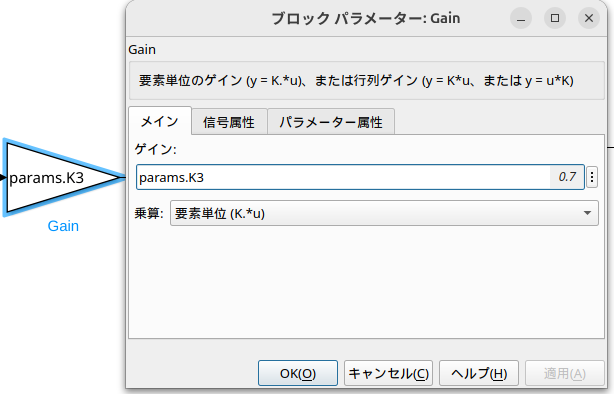

# simukinkのpythonでの使用方法
simulinkのモデルをC言語にコンパイルしそのC言語で書かれたファイルをpythonで使用する方法を説明します
## 注意事項
Ubunu(Linux)環境での動作を想定しています．Windowsで動作する保証はないです．
## 準備事項
gcc,g++のインストール
  ```console
  sudo apt install gcc
  sudo apt instakk g++
  ```

# 動作手順
1. コンパイルするsimulinkモデルの作成
外部(python)側から変更したいパラメータはmファイルで設定しますがグローバル変数で定義する必要があります．
mファイルで定義したパラメータをブロック線図に入力してください.<br>
例)
```console
params_T = Simulink.Bus;
params_T.Description = 'モデルパラメータの設定';
params_T.DataScope   = 'Exported';
params_T.HeaderFile  = 'params_T.h';
params_T.Elements(1) = Simulink.BusElement;
params_T.Elements(1).Name     = 'K3'; #ここの名前を変更してください
params_T.Elements(1).DataType = 'double';
```

2. コンパイル
mファイルを実行しC言語にコンパイル，soファイルの作成(パラメータ名は任意で定義してください)：
  ```console
  ./build_simulink_model.m
  ```
3. pythonでsoファイルを読み込み実行({simulink_model}は適宜書き換えてください)：
  ```console
  ./simulink_model_execution.py
  ```
  モデルの読み込み
  ```console
  lib.{simulink_model}._initialize()
  ```
  ステップ処理
  ```console
  lib.{simulink_model}._step()
  ```
  モデルの終了処理
  ```console
  lib.{simulink_model}_terminate()
  ```
