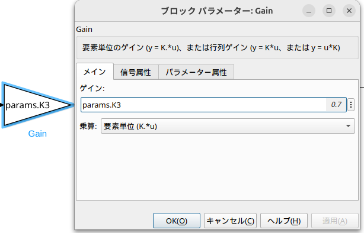

# simukinkのpythonでの使用方法
simulinkのモデルをC言語にコンパイルしそのC言語で書かれたファイルをpythonで使用する方法を説明します
## 注意事項
Ubunu(Linux)環境での動作を想定しています．Windowsで動作する保証はないです．
## 準備事項
gcc,g++のインストール
  ```console
  sudo apt install gcc
  sudo apt instakk g++
  ```

# 動作手順
1. コンパイルするsimulinkモデルの作成<br>
 実行時に変更したいパラメータについてはsimulinkモデル上では変数として設定してください. コンパイル時の設定（手順２）のために, この例ではパラメータは構造体paramsのメンバとして設定しています. 
mファイルで定義したいパラメータをブロック線図に入力してください.<br>




2. mファイルによるコンパイル<br>
 まず, 作成したsimulinkモデルと整合するようにmファイルを編集します. 
 外部(python)側から変更したいパラメータを mファイルでグローバル変数として指定する必要があります．
 この際, mファイルではデータ型の定義と値の定義をそれぞれ行う必要があり, この例では, データ型の定義を「params_T」とし, 変数の定義を「params」としています. 

例)
```console
params_T = Simulink.Bus;
params_T.Description = 'モデルパラメータの設定';
params_T.DataScope   = 'Exported';
params_T.HeaderFile  = 'params_T.h';
params_T.Elements(1) = Simulink.BusElement;
params_T.Elements(1).Name     = 'K3'; #ここの名前を変更してください
params_T.Elements(1).DataType = 'double';

params = Simulink.Parameter;
params.DataType     = 'Bus: params_T';
params.StorageClass = 'ExportedGlobal';
params.Value.K3     = 0.7;

```

 mファイルが編集できたら, これを実行しC言語にコンパイル，soファイルの作成(パラメータ名は任意で定義してください)：
```console
./build_simulink_model.m
```


3. pythonで利用<br>
pythonでsoファイルを読み込み実行({simulink_model}は適宜書き換えてください)：
  ```console
  ./simulink_model_execution.py
  ```

mファイル上で定義した構造体とpythonの構造体を一致する必要があります．手順２で定義した構造体の全要素を羅列する必要があります．

例)
```console
class params_T(ctypes.Structure):
    _fields_ = [
        ('K3', ctypes.c_double)
        # 必要に応じて追加
    ]
```

また入出力も一致させる必要があります．

例）
```console
class ExtU(ctypes.Structure):
    _fields_ = [
        ('In1', ctypes.c_double)
        # Simulinkモデルの入力の数だけ羅列
    ]

class ExtY(ctypes.Structure):
    _fields_ = [
        ('Te', ctypes.c_double),
        ('Eg', ctypes.c_double),
        ('Es', ctypes.c_double),
        ('Wf', ctypes.c_double),
        ('Wr', ctypes.c_double)
        # Simulinkモデルの出力の数だけ羅列
    ]
```
上記設定後，以下の関数を使用することでsimulinkモデルをpythonで実行できます．

  モデルの読み込み
  ```console
  lib.{simulink_model}._initialize()
  ```
  ステップ処理
  ```console
  lib.{simulink_model}._step()
  ```
  モデルの終了処理
  ```console
  lib.{simulink_model}_terminate()
  ```
